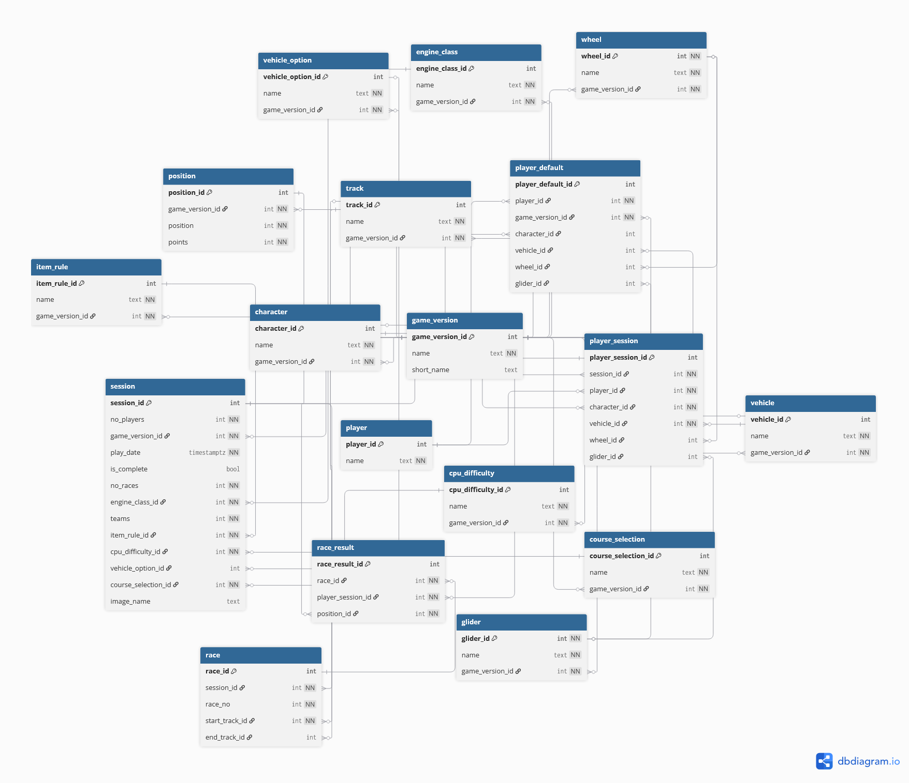

# Mario Kart Tracker
## Database Documentation

## Contents

1. Overview
2. Table Summary
3. Table Reference
4. Relationships
5. ERD
6. Design Notes

## 1. Overview 
MK Tracker is a personal project database designed to record and analyse the results of Mario Kart VS Race sessions. It supports multiple game versions, and tracks and session settings, player selections, race results, and point totals. The app primarily supports Mario Kart 8 Deluxe and Mario Kart World though the database has been designed with possible future additions in mind.

The database is structured around a central session concept: each session captures the game settings selected before play, the choices made by each player, and the results of each individual race. Reference tables provide the valid values for game-version-specific settings.

### Scope & Assumptions
The following assumptions are built into the schema:
* Only VS Race sessions are tracked. Grand Prix and other modes are out of scope.
* A session is assumed to be incomplete until explicitly marked as complete (is_complete defaults to false).
* A session is assumed to occur on a single calendar day.
* Wheel and glider selections apply to Mario Kart 8 Deluxe only and are stored as nullable columns where relevant.
* For Mario Kart World, races may span multiple tracks (start_track_id and end_track_id); for MK 8 Deluxe, only start_track_id applies.
* Player names are unique, which is considered sufficient given the small intended user base.
* Player session selections are stored directly rather than referencing the player default, ensuring historical accuracy even if defaults change.

## 2. Table Summary

The databasse contains 18 tables, listed below with a brief description of each

| Table | Columns | Description |
|:------|--------:|:------------|
| `game_version` | 3 | Stores the Mario Kart versions that are available in the app |
| `character` | 3 | Stores the characters that may be selected by the player during session setup. |
| `engine_class` | 3 | Stores the engine classes that may be selected by the player during session setup (50cc, 100cc, etc.). |
| `vehicle_option` | 3 | Stores the options for vehicle types of the CPU players. |
| `vehicle` | 3 | Stores the names of vehicles that may be selected by the player during session setup. |
| `wheel` | 3 | Stores the names of various wheel options that may be selected by the player during session setup. |
| `glider` | 3 | Stores the names of various glider options that may be selected by the player during session setup. |
| `course_selection` | 3 | Stores the course selection regimes that are available during session setup. |
| `item_rule` | 3 | Stores the item rule sets that are available during session setup. |
| `cpu_difficulty` | 3 | Stores the cpu difficulty levels that are available during session setup. |
| `player` | 2 | Stores the names of players for whom to store results. |
| `player_default` | 7 | Favourite setups for a player. |
| `session` | 13 | The settings for a single VS Race session of Mario Kart. |
| `player_session` | 7 | Selections made by a player during session setup. |
| `track` | 3 | Stores the names of tracks to be played during a session. |
| `race` | 5 | Stores the details of each race within a session.  |
| `position` | 4 | Stores the scores allocated to each position for each version of the game. |
| `race_result` | 4 | Stores the results of races for each player. |

## 3. Table Reference
This section documents each table in detail, including all columns and indexes.

### 3.1 `game_version`
Stores the Mario Kart versions that are available in the app.

#### Columns
| Column | Type | Nullable | Key | Foreign Key | Notes |
|--------|------|----------|-----|-------------|-------|
| `game_version_id` | `int` | No | PK | - | Primary key (auto increment) |
| `name` | `text` | No | - | - | The name of the game, e.g. 'Mario Kart 8 Deluxe' |
| `short_name` | `text` | Yes | - | - | Short name of the game, used for coding purposes, eg. 'mk8' |

#### Indexes & Constraints
| Index | Columns | Type |
|-------|---------|------|
| `pk_game_version` | `game_version_id` | Primary key |

### 3.2 `character`
Stores the characters that may be selected by the player during session setup.

#### Columns
| Column | Type | Nullable | Key | Foreign Key | Notes |
|--------|------|----------|-----|-------------|-------|
| `character_id` | int | No | PK | — | Primary key (auto-increment) |
| `name` | text | No | — | — | Character name |
| `game_version_id` | int | No | FK | `game_version`.game_version_id` | Game version this character belongs to |

#### Indexes & Constraints
| Index | Columns | Type |
|-------|---------|------|
| `pk_character` | `character_id` | Primary Key |
| `nk_character` | `game_version_id`, `name` | Unique |

### 3.3 `engine_class`
Stores the engine classes that may be selected by the player during session setup.

#### Columns
| Column | Type | Nullable | Key | Foreign Key | Notes |
|--------|------|----------|-----|-------------|-------|
| `engine_class_id` | `int` | No | PK | — | Primary key (auto-increment) |
| `name` | `text` | No | — | — | Engine class name (e.g. 150cc) |
| `game_version_id` | `int` | No | FK | `game_version`.game_version_id` | Game version this engine class belongs to |

#### Indexes & Constraints
| Index | Columns | Type |
|-------|---------|------|
| `pk_engine_class` | `engine_class_id` | Primary Key |
| `nk_engine_class` | `game_version_id`, `name` | Unique |

### 3.4 `vehicle_option`
Stores the options for vehicle types of the CPU players. Only applies to Mario Kart 8 Deluxe

#### Columns
| Column | Type | Nullable | Key | Foreign Key | Notes |
|--------|------|----------|-----|-------------|-------|
| `vehicle_option_id` | `int` | No | PK | — | Primary key (auto-increment) |
| `name` | `text` | No | — | — | The name of the CPU vehicle option regime |
| `game_version_id` | `int` | No | FK | `game_version`.game_version_id` | The game version in which this vehicle option regime applies |

#### Indexes & Constraints
| Index | Columns | Type |
|-------|---------|------|
| `pk_vehicle_option` | vehicle_option_id | Primary key |
| `nk_vehicle_option` | `name`, `game_version_id` | Unique |

### 3.5 `vehicle`
Stores the names of vehicles that may be selected by the player during session setup.

#### Columns
| Column | Type | Nullable | Key | Foreign Key | Notes |
|--------|------|----------|-----|-------------|-------|
| `vehicle_id` | `int` | No | PK | — | Primary key (auto-increment) |
| `name` | `text` | No | — | — | Vehicle name |
| `game_version_id` | `int` | No | FK | `game_version`.game_version_id` | Game version this vehicle belongs to |

#### Indexes & Constraints
| Index | Columns | Type |
|-------|---------|------|
| `pk_vehicle` | `vehicle_id` | Primary Key |
| `nk_vehicle` | `game_version_id`, `name` | Unique |

### 3.6 `wheel`
Stores the names of various wheel options that may be selected by the player during session setup.
  
This only applies to MK 8, but to allow for future expansion we will include the game version

#### Columns
| Column | Type | Nullable | Key | Foreign Key | Notes |
|--------|------|----------|-----|-------------|-------|
| `wheel_id` | `int` | No | PK | — | Primary key |
| `name` | `text` | No | — | — | Wheel name |
| `game_version_id` | `int` | No | FK | `game_version`.game_version_id` | The game version that this wheel is in. |

#### Indexes & Constraints
| Index | Columns | Type |
|-------|---------|------|
| `pk_wheel` | `wheel_id` | Primary Key |
| `nk_wheel` | `name` | Unique |

### 3.7 `glider`
Stores the names of various glider options that may be selected by the player during session setup
  
This only applies to MK 8, but to allow for future expansion we will include the game version

#### Columns
| Column | Type | Nullable | Key | Foreign Key | Notes |
|--------|------|----------|-----|-------------|-------|
| glider_id | `int` | No | PK | — | Primary key |
| `name` | `text` | No | — | — | Glider name |
| `game_version_id` | `int` | No | FK | `game_version`.game_version_id` | The game version that this glider is in. |

#### Indexes & Constraints
| Index | Columns | Type |
|-------|---------|------|
| `pk_glider` | `glider_id` | Primary Key |
| `nk_glider` | `name` | Unique |

### 3.8 `course_selection`
Stores the course selection regimes that are available during session setup

#### Columns
| Column | Type | Nullable | Key | Foreign Key | Notes |
|--------|------|----------|-----|-------------|-------|
| `course_selection_id` | `int` | No | PK | — | Primary key (auto-increment) |
| `name` | `text` | No | — | — | Name of the course selection regime |
| `game_version_id` | `int` | No | FK | `game_version`.game_version_id` | Game version this regime applies to |

#### Indexes & Constraints
| Index | Columns | Type |
|-------|---------|------|
| `pk_course_selection` | `course_selection_id` | Primary Key |
| `nk_course_selection` | `name`, `game_version_id` | Unique |

### 3.9 `item_rule`
Stores the item rule sets that are available during session setup. May include "custom", but doesn't specify which items are included.

#### Columns
| Column | Type | Nullable | Key | Foreign Key | Notes |
|--------|------|----------|-----|-------------|-------|
| `item_rule_id` | `int` | No | PK | — | Primary key (auto-increment) |
| `name` | `text` | No | — | — | Name of the item rule set |
| `game_version_id` | `int` | No | FK | `game_version`.game_version_id` | Game version this rule set applies to |

#### Indexes & Constraints
| Index | Columns | Type |
|-------|---------|------|
| `pk_item_rule` | `item_rule_id` | Primary Key |
| `nk_item_rule` | `name`, `game_version_id` | Unique |

### 3.10 `cpu_difficulty`
Stores the cpu difficulty levels that are available during session setup.

#### Columns
| Column | Type | Nullable | Key | Foreign Key | Notes |
|--------|------|----------|-----|-------------|-------|
| `cpu_difficulty_id` | `int` | No | PK | — | Primary key (auto-increment) |
| `name` | `text` | No | — | — | Name of the difficulty level |
| `game_version_id` | `int` | No | FK | `game_version`.game_version_id` | Game version this difficulty level applies to |

#### Indexes & Constraints
| Index | Columns | Type |
|-------|---------|------|
| `pk_cpu_difficulty` | `cpu_difficulty_id` | Primary Key |
| `nk_cpu_difficulty` | `name`, `game_version_id` | Unique |

### 3.11 `player`
Stores the names of players for whom to store results.

#### Columns
| Column | Type | Nullable | Key | Foreign Key | Notes |
|--------|------|----------|-----|-------------|-------|
| `player_id` | `int` | No | PK | — | Primary key (auto-increment) |
| `name` | `text` | No | — | — | Player name (unique) |

#### Indexes & Constraints
| Index | Columns | Type |
|-------|---------|------|
| `pk_player` | `player_id` | Primary Key |
| `nk_player` | `name` | Unique |

### 3.12 `player_default`
Favourite setups for a player. A player may have a single favourite setup for each version of Mario Kart. They do not have to make a selection for each option.

#### Columns
| Column | Type | Nullable | Key | Foreign Key | Notes |
|--------|------|----------|-----|-------------|-------|
| `player_default_id` | `int` | No | PK | — | Primary key (auto-increment) |
| `player_id` | `int` | No | FK | `player.player_id` | The player this default belongs to |
| `game_version_id` | `int` | No | FK | `game_version`.game_version_id` | The game version this default applies to |
| `character_id` | `int` | Yes | FK | `character.character_id` | Preferred character (optional) |
| `vehicle_id` | `int` | Yes | FK | `vehicle.vehicle_id` | Preferred vehicle (optional) |
| `wheel_id` | `int` | Yes | FK | `wheel.wheel_id` | Preferred wheels — MK 8 Deluxe only (optional) |
| `glider_id` | `int` | Yes | FK | `glider.glider_id` | Preferred glider — MK 8 Deluxe only (optional) |

#### Indexes & Constraints
| Index | Columns | Type |
|-------|---------|------|
| `pk_player_default` | `player_default_id` | Primary Key |
| `nk_player_default` | `player_id`, `game_version_id` | Unique |

### 3.13 `session`
The settings for a single VS Race session of Mario Kart. Not all settings apply to every version of the game. Does not apply to other race types (e.g. Grand Prix).

Assumes that a session is incomplete until updated, and that a session only takes place on a single calendar day.

#### Columns
| Column | Type | Nullable | Key | Foreign Key | Notes |
|--------|------|----------|-----|-------------|-------|
| `session_id` | `int` | No | PK | — | Primary key (auto-increment) |
| `no_players` | `int` | No | — | — | Number of players in the session |
| `game_version_id` | `int` | No | FK | `game_version`.game_version_id` | Game version played |
| `play_date` | `datetime` | No | — | — | Date and time the session was played |
| `is_complete` | `bool` | No | — | — | Whether the session was completed; defaults to false |
| `no_races` | `int` | No | — | — | Number of races selected (not necessarily played) |
| `engine_class_id` | `int` | No | FK | `engine_class.engine_class_id` | Engine class selected for the session |
| `teams` | `int` | No | — | — | Number of teams; 0 indicates no teams |
| `item_rule_id` | `int` | No | FK | `item_rule.item_rule_id` | Item rule set selected for the session |
| `cpu_difficulty_id` | `int` | No | FK | `cpu_difficulty.cpu_difficulty_id` | CPU difficulty level selected |
| `vehicle_selection` | `text` | Yes | — | — | CPU vehicle types allowed — MK 8 Deluxe only (optional) |
| `course_selection_id` | `int` | No | FK | `course_selection.course_selection_id` | Course selection regime used |
| `image_name` | `text` | Yes | — | — | Filename of an image showing session selections (optional) |

#### Indexes & Constraints
| Index | Columns | Type |
|-------|---------|------|
| `pk_session` | `session_id` | Primary Key |

### 3.14 `player_session`
Selections made by a player during session setup. 

Selections from the `player_default` table will be re-entered, rather than inserting a reference.

#### Columns
| Column | Type | Nullable | Key | Foreign Key | Notes |
|--------|------|----------|-----|-------------|-------|
| `player_session_id` | `int` | No | PK | — | Primary key (auto-increment) |
| `session_id` | `int` | No | FK | `session.session_id` | The session this setup belongs to |
| `player_id` | `int` | No | FK | `player.player_id` | The player this setup belongs to |
| `character_id` | `int` | No | FK | `character.character_id` | Character chosen for this session |
| `vehicle_id` | `int` | No | FK | `vehicle.vehicle_id` | Vehicle chosen for this session |
| `wheel_id` | `int` | Yes | FK | `wheel.wheel_id` | Wheels chosen — MK 8 Deluxe only (optional) |
| glid`er_id | `int` | Yes | FK | `glider.glider_id` | Glider chosen — MK 8 Deluxe only (optional) |

#### Indexes & Constraints
| Index | Columns | Type |
|-------|---------|------|
| `pk_player_session` | `player_session_id` | Primary Key |
| `nk_player_session` | `session_id`, `player_id` | Unique |

### 3.15 `track`
Stores the names of tracks to be played during a session.

#### Columns
| Column | Type | Nullable | Key | Foreign Key | Notes |
|--------|------|----------|-----|-------------|-------|
| `track_id` | `int` | No | PK | — | Primary key (auto-increment) |
| `name` | `text` | No | — | — | Track name |
| `game_version_id` | `int` | No | FK | `game_version`.game_version_id` | Game version containing this track |

#### Indexes & Constraints
| Index | Columns | Type |
|-------|---------|------|
| `pk_track` | `track_id` | Primary Key |
| `nk_track` | `name`, `game_version_id` | Unique |

### 3.16 `race`
Stores the details of each race within a session. 
  
For Mario Kart 8, only `start_track_id` should be completed. For Mario Kart World, `end_track_id` may be null or the same as `start_track_id` (indicates that it was a single-track race).

#### Columns
| Column | Type | Nullable | Key | Foreign Key | Notes |
|--------|------|----------|-----|-------------|-------|
| `race_id` | `int` | No | PK | — | Primary key (auto-increment) |
| `session_id` | `int` | No | FK | `session.session_id` | Session this race belongs to |
| `race_no` | `int` | No | — | — | Race number within the session |
| `start_track_id` | `int` | No | FK | `track.track_id` | Track for MK 8, or starting track for MK World |
| `end_track_id` | `int` | Yes | FK | `track.track_id` | Ending track — MK World only (null = single-track race) |

#### Indexes & Constraints
| Index | Columns | Type |
|-------|---------|------|
| `pk_race` | `race_id` | Primary Key |
| `nk_race` | `session_id`, `race_no` | Unique |

### 3.17 `position`
Stores the scores allocated to each position for each version of the game.

#### Columns
| Column | Type | Nullable | Key | Foreign Key | Notes |
|--------|------|----------|-----|-------------|-------|
| `position_id` | `int` | No | PK | — | Primary key (auto-increment) |
| `game_version_id` | `int` | No | FK | `game_version`.game_version_id` | Game version these points apply to |
| `position` | `int` | No | — | — | Finishing position (ordinal) |
| `points` | `int` | No | — | — | Points awarded for this position |

#### Indexes & Constraints
| Index | Columns | Type |
|-------|---------|------|
| `pk_position` | `position_id` | Primary Key |
| `nk_position` | `game_version_id`, `position` | Unique |

### 3.18 `race_result`
Stores the results of races for each player. Given that positions are tied to points, a foreign key relationship is required.

#### Columns
| Column | Type | Nullable | Key | Foreign Key | Notes |
|--------|------|----------|-----|-------------|-------|
| `race_result_id` | `int` | No | PK | — | Primary key (auto-increment) |
| `race_id` | `int` | No | FK | `race.race_id` | The race this result belongs to |
| `player_session_id` | `int` | No | FK | `player_session.player_session_id` | The player-session this result belongs to |
| `position_id` | `int` | No | FK | `position.position_id` | The position (and associated points) the player finished |

#### Indexes & Constraints
| Index | Columns | Type |
|-------|---------|------|
| `pk_race_result` | `race_result_id` | Primary Key |
| `nk_race_result` | `race_id`, `player_id` | Unique |

## 4. Relationships
All foreign key relationships are listed below. All relationships are many-to-one (i.e. each child row references exactly one parent row).

| Constraint Name | From | To |
| --- | --- | --- |
| `fk_vehicle_option_in_game_version` | `vehicle_option.game_version_id` | `game_version.game_version_id` |
| `fk_wheel_in_game_version` | `wheel.game_version_id` | `game_version.game_version_id` |
| `fk_glider_in_game_version` | `glider.game_version_id` | `game_version.game_version_id` |
| `fk_course_selecion_for_game_version` | `course_selection.game_version_id` | `game_version.game_version_id` |
| `fk_item_rule_for_game_version` | `item_rule.game_version_id` | `game_version.game_version_id` |
| `fk_difficulty_for_game_version` | `cpu_difficulty.game_version_id` | `game_version.game_version_id` |
| `fk_session_of_game_version` | `session.game_version_id` | `game_version.game_version_id` |
| `fk_cc_of_session` | `session.engine_class_id` | `engine_class.engine_class_id` |
| `fk_course_selection_of_session` | `session.course_selection_id` | `course_selection.course_selection_id` |
| `fk_item_rule_of_session` | `session.item_rule_id` | `item_rule.item_rule_id` |
| `fk_cpu_difficulty_of_session` | `session.cpu_difficulty_id` | `cpu_difficulty.cpu_difficulty_id` |
| `fk_vehicle_option_of_session` | `session.vehicle_option_id` | `vehicle_option.vehicle_option_id` |
| `fk_player_default_for_player` | `player_default.player_id` | `player.player_id` |
| `fk_player_default_for_game_version` | `player_default.game_version_id` | `game_version.game_version_id` |
| `fk_character_selected_for_player_default` | `player_default.character_id` | `character.character_id` |
| `fk_vehicle_selected_for_player_default` | `player_default.vehicle_id` | `vehicle.vehicle_id` |
| `fk_wheel_selected_for_player_default` | `player_default.wheel_id` | `wheel.wheel_id` |
| `fk_glider_selected_for_player_default` | `player_default.glider_id` | `glider.glider_id` |
| `fk_player_in_player_session` | `player_session.player_id` | `player.player_id` |
| `fk_session_in_player_session` | `player_session.session_id` | `session.session_id` |
| `fk_character_selected_for_player_session` | `player_session.character_id` | `character.character_id` |
| `fk_vehicle_selected_for_player_session` | `player_session.vehicle_id` | `vehicle.vehicle_id` |
| `fk_wheel_selected_for_player_session` | `player_session.wheel_id` | `wheel.wheel_id` |
| `fk_glider_selected_for_player_session` | `player_session.glider_id` | `glider.glider_id` |
| `fk_track_in_game_version` | `track.game_version_id` | `game_version.game_version_id` |
| `fk_race_in_session` | `race.session_id` | `session.session_id` |
| `fk_start_race_on_track` | `race.start_track_id` | `track.track_id` |
| `fk_end_race_on_track` | `race.end_track_id` | `track.track_id` |
| `fk_race_result_for_race` | `race_result.race_id` | `race.race_id` |
| `fk_race_result_for_player` | `race_result.player_session_id` | `player_session.player_session_id` |
| `fk_position_for_race_result` | `race_result.position_id` | `position.position_id` |
| `fk_vehicle_in_game_version` | `vehicle.game_version_id` | `game_version.game_version_id` |
| `fk_character_in_game_version` | `character.game_version_id` | `game_version.game_version_id` |
| `fk_engine_class_in_game_version` | `engine_class.game_version_id` | `game_version.game_version_id` |
| `fk_position_for_game_version` | `position.game_version_id` | `game_version.game_version_id` |

## 5. ERD

## 6. Design Notes
1.  Game version as a filter key
Reference tables (`character`, `vehicle`, `track`, `course_selection`, etc.) include a `game_version_id` column. This is intentional. It allows the application to filter available options based on the version of the game being played, rather than showing all options regardless of applicability. 

2.  Wheel and glider tables have no game_version_id
Wheels and gliders are specific to Mario Kart 8 Deluxe and do not vary between game versions in any meaningful way. However, the tables still reference `game_version_id` for two reasons: consistency, and to maximise future flexibility in case additional game versions are added that require these tables. Columns referencing `wheel_id` and `glider_id` in other tables are nullable for non-MK8D sessions.

3.  Player defaults are copied, not referenced, at session time
When a session is set up, a player's default selections are re-entered into `player_session` rather than pointing to `player_default`. This ensures that race history remains accurate even if a player updates their defaults later.

4.  Points are linked via position, not stored directly on `race_result`
Rather than storing a points value directly on `race_result`, the position_id column references the position table which maps positions to points per game version. This keeps point values consistent and avoids manual entry errors.

5.  Natural keys alongside surrogate keys
Each table uses an auto-increment surrogate primary key for simplicity, but also defines a natural key (unique constraint on the meaningful business columns) to prevent duplicate data. For example, `nk_character` enforces uniqueness on (`game_version_id`, `name`).

6.  `teams` column stores a count, not a foreign key
The number of teams in a session is stored as an integer (0 = no teams) rather than modelled as a separate table. Given the personal scope of the project, this simpler approach is sufficient.
