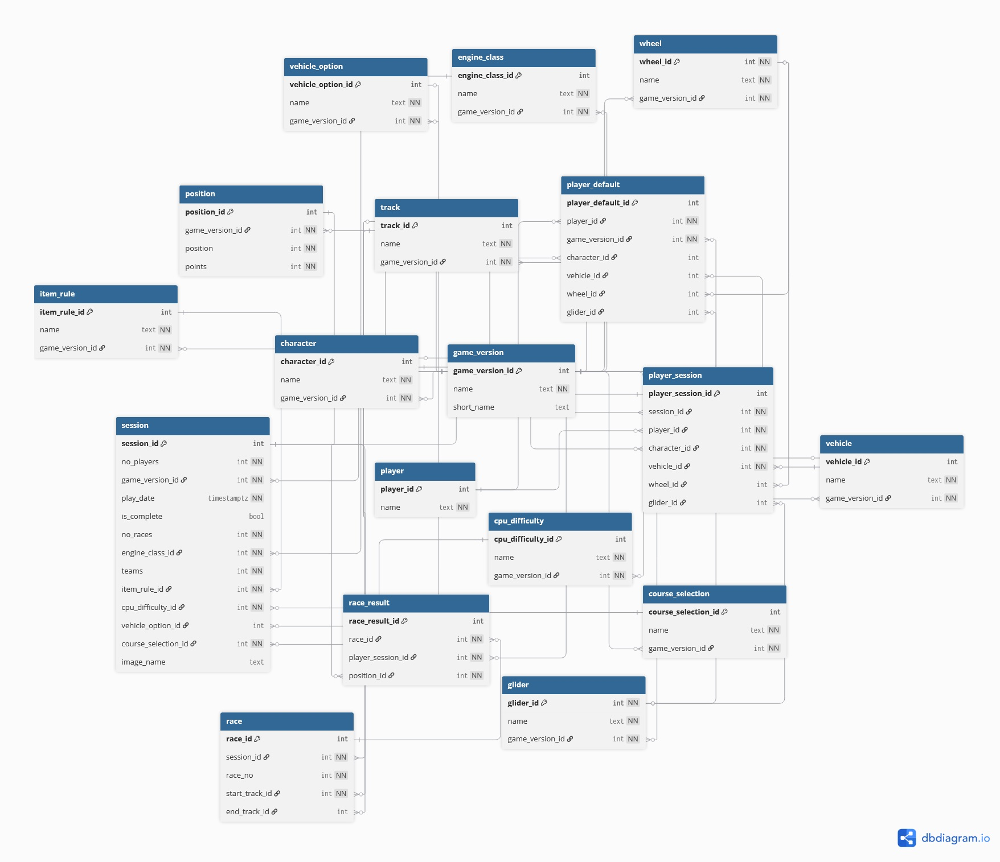

# Mario Kart Tracker
A small Django-based web app to track results of races in the video game *Mario Kart*

While this is a Django app, the database was independently modelled and implemented prior to development. Django models originated from the implemented database using the `inspectdb` tool, and were updated as necessary.

Full schema documentation on the database can be found [here](./Database%20Documentation.md).

## Overview
This app is designed to record results of VS races in the video game *Mario Kart*. Specifically, the app refers to *Mario Kart 8 Deluxe* and *Mario Kart World*. 

The ultimate aim of collecting this data was to explore and analyse it, including identifying trends amongst individual players (e.g. if a player does better on some tracks) and overall (e.g. frequency of tracks when selecting "Random").

## Data Modelling

As stated earlier, the database was modelled and implemented prior to any Django development. I did this so that I could model the data explicitly and have finer control over the implementation, rather than simply relying on Django's ORM.

**Key design decisions:**
* I chose to model to 3NF to reduce data redundancy as much as possible
* I modeled the database with possible futre expansion in mind, aiming to minimise the number of changes that would be needed (e.g. if another game is added)
* For each table I identified a potential natural key to reduce the scope for manual insertion errors. For simplicity, however, I also included surrogate keys.

Full database schema documentation, including table and relationship definitions and design rational can be found [here](./Database%20Documentation.md).